# Citas MongoDB

En este Taller estamos Generando una Base de Datos en mongo apartir de una base de datos de Mysql para un sistema de control de citas, imlementado nuevas tecnologias para optimizar las consultas


# DATABASE A USAR

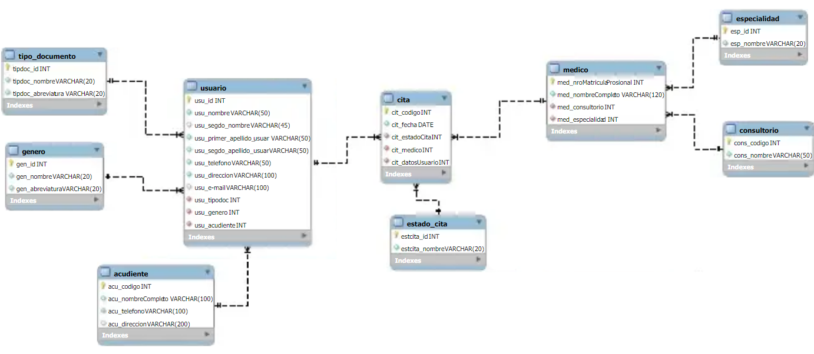<br><br>


# DEPENDENCIAS IMPLEMENTADAS

```JSON
    "class-transformer": "0.5.1",
    "class-validator": "0.14.0",
    "cookie-parser": "1.4.6",
    "dotenv": "16.3.1",
    "express": "4.18.2",
    "express-query-boolean": "2.0.0",
    "express-rate-limit": "6.8.1",
    "express-routes-versioning": "^1.0.1",
    "express-session": "1.17.3",
    "express-validator": "7.0.1",
    "jose": "4.14.4",
    "mongodb": "5.7.0",
    "nodemon": "3.0.1",
    "passport": "0.6.0",
    "passport-http-bearer": "1.0.1",
    "reflect-metadata": "0.1.13"
```
<br><br>

# IMPLEMENTACION PROYECTO

### CLONACION DEL REPOSITORIO

Clonamos el repositorio con visual estudio code y lo guardamos en una carpeta de nuestra elección

```
https://github.com/JoseCabrejoVillarCampus/mongoCitasMedicas
```
<br><br>

### INSTALACION DE DEPENDENCIAS

Para Usar las Dependencias que estan en el package.json :
```
npm install
```
<br><br>

# CONFIGURACION DEL .env

Dentro de la Ruta que creamos para alojar el proyecto buscamos  el  archivo llamado ".env.example" y lo cambiamos por ".env"
En el archivo .env, configurar las siguientes variables de conexión a la base de datos:
```
MY_SERVER={"hostname":"","port":""}
ATLAS_USER=""
ATLAS_PASSWORD=""
ATLAS_DB=""
JWT_PRIVATE_KEY=""
```
En el campo de MY_SERVER ingrese un hostname y un puerto a su elección(preferiblemente mayor al 5000). Recuerde que por defecto el local host requiere que el hostname es 127.0.0.1. pero puede ser,
ATLAS_USER es el usuario de la base de datos registrado en Atlas y ATLAS_PASSWORD es la contraseña que le asignamos, ATLAS_DB es el nombre de la base de datos y el JWT_PRIVATE_KEY es la palabra secreta que usaremos para generar los tokens de JWT
<br><br>

# INICIAR nodemon

```
npm run dev
```
<br><br>

# INSTALACION BASE DE DATOS

Teniendo una cuenta en MongoDB Atlas, ya registrado indicado en la documentacion
https://github.com/JoseCabrejoVillarCampus/mongoDocumentacion

Nos dirigimos la carpeta [db](db), en el archivo  [query.mongodb](db/query.mongodb)
aca observaremos que para crear las coleciones, hemos realizado esquemas para la verificacion de tipo y patrones de datos

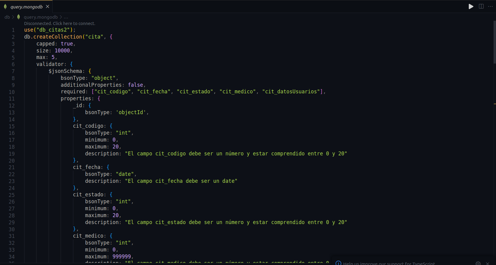<br><br>

Procedemos a ejecutarlo uno por uno, en este caso hemos puesto la creacion de la colecion y la insercion de datos para cada una seguidamente, vasta con seleccionar la coleccion y dar en el boton "RUN" alojado en la esquina derecha superior

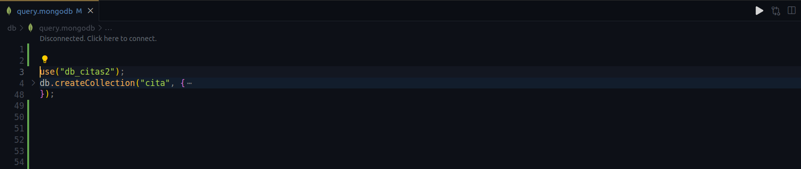<br><br>

Diseño para la insercion de varios Datos para la tabla correspondiente, la ejecutamos de forma igual a la creacion de la coleccion

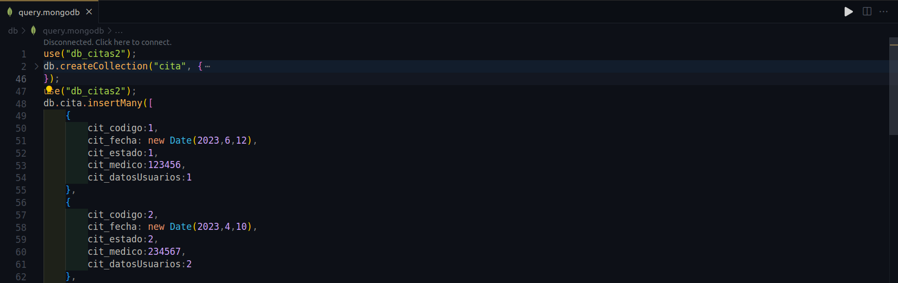<br><br>

# INSTALACION COLECCIONES CLIENTE Y LOGIN

Ahora nos dirigimos dentro de la misma carpeta [db](db), esta vez en el archivo  [query.mongodb](db/queryUsuarios.mongodb), en este archivo vamos a crear las colecciones <span style="color:green;">cliente</span> , <span style="color:green;">login</span> , <span style="color:green;">rol</span>,para la validacion por token del portador segun la strategia [http-passport-bearer](https://www.passportjs.org/packages/passport-http-bearer/), en nuestro proyecto [passPortHelper](helpers/passPortHelper.js), ademas de otras peueñas cosas, que simplemente ahi que ejecutar con el boton RUN

## Creación de las Colecciones

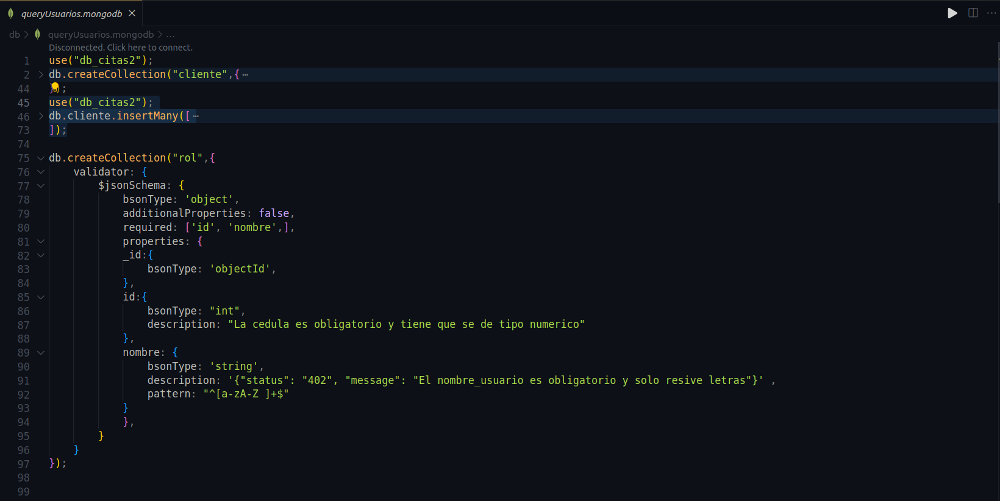<br><br>

## Defininendo los Perimsos por Usuario

<br><br>

## Creacion del Autoincremental

Esta nos permite dar un id autoincremental a cada rol agregado

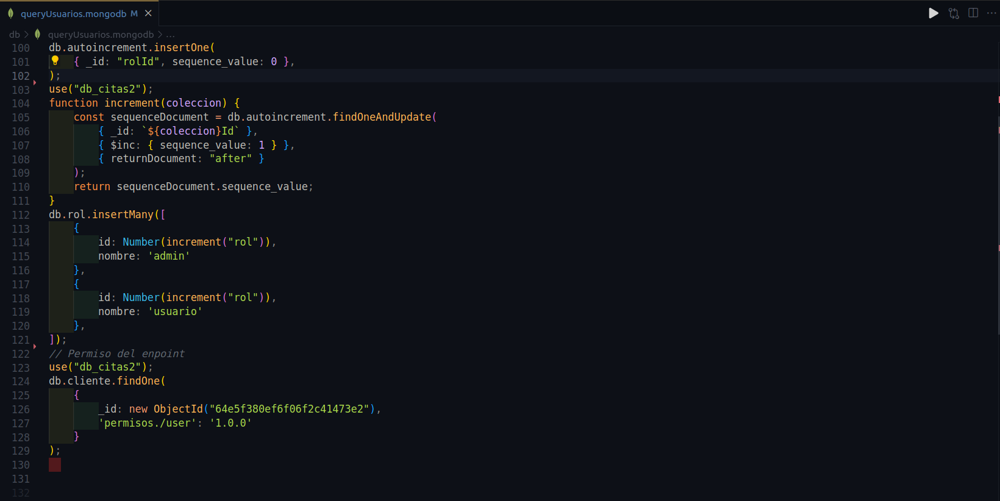<br><br>

# GENERACION DE TOKEN DE ACCESO

En esta ocacion, hemos generado un token de acceso unico para cada usuario, basandonos en su esquema, rol y  permisos, este codigo lo podemos observar dentro de la carpeta [helpers](helpers), en el archivo [JWT.js](helpers/JWT.js)

Generar Token de acceso 

- Generación: Una vez dentro del cliente que estemos usando,("En este caso estamos ejecutando en thunderClient"), a traves
del metodo POST

```js
  http://${config.hostname}:${config.port}/login
```

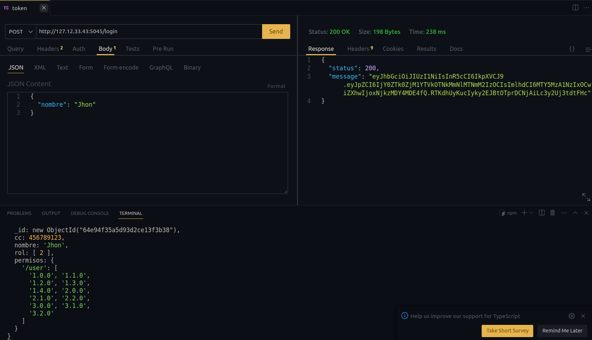<br><br>

Donde debemos pasarle un body con un nombre que tengamos creado ya en la base de datos, dentro de la coleccion cliente, tambien vemos los permisos para las versiones que este tiene:

```js
  {
    "nombre": "Jhon"
  }
```
```js
  {
    "nombre": "Marcos"
  }
```
<br><br>

En este ejemplo vemos que "Jhon" y "Marcos", tienen permisos diferentes

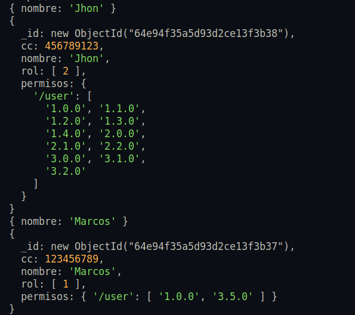<br><br>


Este token tiene un limite de tiempo, en ese rango de tiempo podremos acceder a las rutas y endPoints de nuestra Api. Una vez pasada esta hora será necesario generar uno nuevo.<br><br>


# CONSULTAS<br><br>


## FUNCIONAMIENTO Y ENDPOINTS.<br><br>


**CRUD DE LAS COLECCIONES**
Los siguiente endPoints corresponden a los CRUDs de cada coleccion, **es importante recordar que para realizar los metodos devimos generar anteriormente el token de usuario y tener los permisos, en este caso Accept-Version de las rutas**.
Para estos endPoints se pueden realizar las consultas básicas, get, get by id, post, put y delete.  <br><br>

* EndPoint CRUD de la Tabla db_cita2:
Estos funciona  para POST/ GET/ DELETE/ PUT/,dentro del cliente que deseemos usar<br><br>

* EndPoint CRUD de la Tabla acudiente: 
```js
  http://${config.hostname}:${config.port}/acudiente
```
<br><br> 

* EndPoint CRUD de la Tabla cita: 
```js
  http://${config.hostname}:${config.port}/cita
```
<br><br>

* EndPoint CRUD de la Tabla consultorio:
```js
  http://${config.hostname}:${config.port}/consultorio
```
<br><br>

* EndPoint CRUD de la Tabla especialidad: 
```js
  http://${config.hostname}:${config.port}/especialidad
```
<br><br>

* EndPoint CRUD de la Tabla estado:
```js
  http://${config.hostname}:${config.port}/estado
```
<br><br>

* EndPoint CRUD de la Tabla genero: 
```js
  http://${config.hostname}:${config.port}/genero
```
<br><br>

* EndPoint CRUD de la Tabla medico: 
```js
  http://${config.hostname}:${config.port}/medico
```
<br><br>

* EndPoint CRUD de la Tabla documento:
```js
  http://${config.hostname}:${config.port}/documento
```
<br><br>

* EndPoint CRUD de la Tabla usuario: 
```js
  http://${config.hostname}:${config.port}/usuario
```
<br><br>


<span style="color:green;">Adicional ahora debemos enviar en los Headers, la version y el token</span><br><br>

<span style="color:blue;">EJEMPLO:</span><br><br>

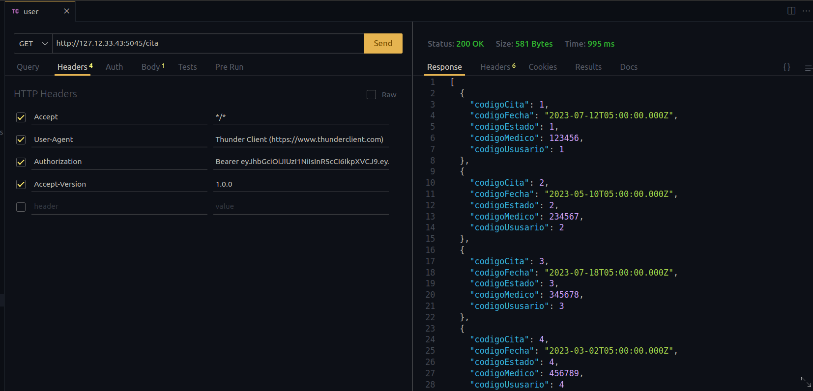<br><br>

Ahora, las versiones disponibles para los Crud normales son

```js
  version:[1.0.0]
```
<br><br>

## Metodo GET BY ID para todas las colecciones

El metodo **GET BY ID** para todas las tablas es el mismo del endpoint,pero si deseamos buscar por ID, si cambia algo la ruta, ya que nos es necesario adicionar un "/" seguido del id que desamos buscar

<span style="color:blue;">EJEMPLO:</span>

```js
  http://${config.hostname}:${config.port}/cita/2
```


En este caso estamos buscando dentro de la coleccion cita, el id especifico 2, que corresponde a nuestro "cit_cod", creado en los esquemeas

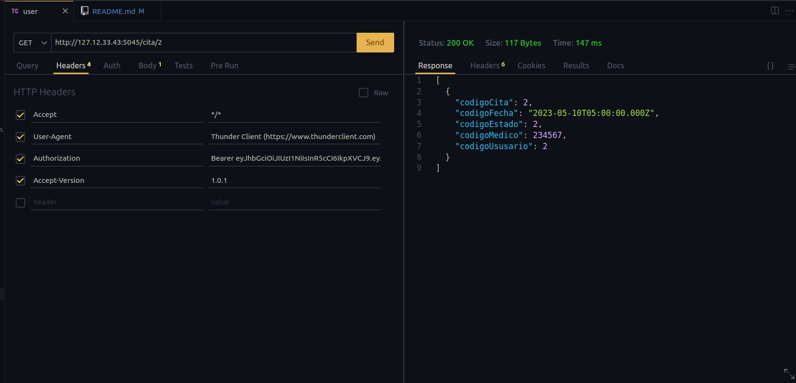<br>


pero aca es necesario ajustar la version

```js
  version:[1.0.1]
```


## Metodo POST para todas las colecciones

El metodo **POST** funciona igual en todas las colecciones, en la misma url del metodo get. 
El body es donde vamos a hacer la insersion de datos y contiene los campos de la coleccion, para cada coleccion el body 
varia, ademas es importante saber que en la insercion de datos aun no usaremos los alias que establecimos en el **dto** de cada coleccion, vamos a usar los que tenemos propios en nuestra base de datos por eso es importante tener presente los campos que corresponden a esta,ya que aun no lo hemos cofigurado adecuadamente, ademas son diferentes de los que nos devuelve el metodo get, que si implementa alias.

```js
  version:[1.0.0]
```

<span style="color:blue;">EJEMPLO:</span>

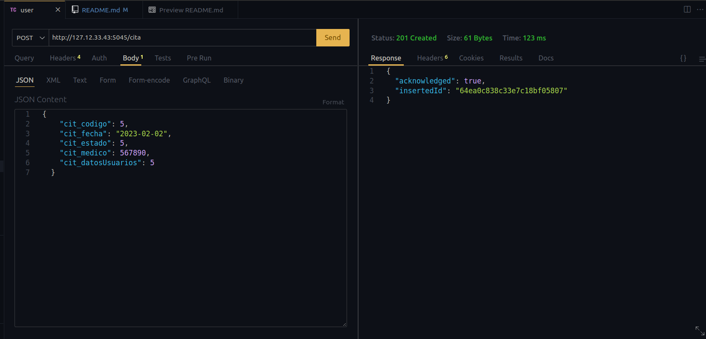


## Metodo PUT para todas las colecciones

El metodo put funciona igual en todas las colecciones, en la misma url del metodo colecciones/id,
este parametro id dentro del body se omite. 
El body es donde vamos a hacer la insersion de datos y contiene los campos de la coleccion, para cada coleccion el body 
varia, ademas es importante saber que en la insercion de datos aun no usaremos los alias que establecimos en el **dto** de cada coleccion, vamos a usar los que tenemos propios en nuestra base de datos por eso es importante tener presente los campos que corresponden a esta,ya que aun no lo hemos cofigurado adecuadamente, ademas son diferentes de los que nos devuelve el metodo get, que si implementa alias.

```js
  version:[1.0.0]
```

<span style="color:blue;">EJEMPLO:</span>

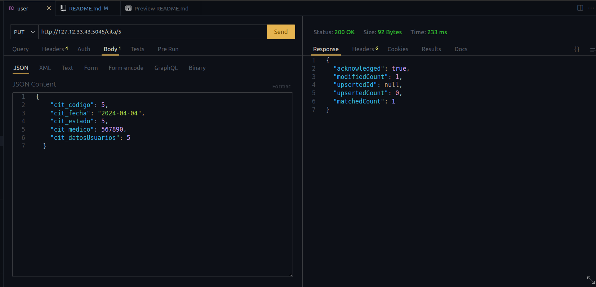

### BODYS para todas las colecciones, en los metodos POST y PUT

<span style="color:blue;">Para Acudiente</span>

```js
  {
    "acu_codigo": 0,
    "acu_nombreCompleto": "",
    "acu_telefono": "",
    "acu_direccion": "",
  }
```

<span style="color:blue;">Para Cita</span>

```js
  {
    "cit_codigo": 0,
    "cit_fecha": "0000-00-00",
    "cit_estado": 0,
    "cit_medico": 000000,
    "cit_datosUsuarios": 0
  }
```

<span style="color:blue;">Para Consultorio</span>

```js
  {
    "cons_codigo": 0,
    "cons_nombre": ""
  }
```

<span style="color:blue;">Para Especialidad</span>

```js
  {
    "esp_id": 0,
    "esp_nombre": ""
  }
```

<span style="color:blue;">Para Estado</span>

```js
  {
    "estcita_id": 0,
    "estcita_nombre": ""
  }
```

<span style="color:blue;">Para Genero</span>

```js
  {
    "gen_id": 0,
    "gen_nombre": "",
    "gen_abreviatura": ""
  }
```

<span style="color:blue;">Para Medico</span>

```js
  {
    "med_nroMatriculaProsional": 000000,
    "med_nombreCompleto": "",
    "med_consultorio": 0,
    "med_especialidad": 0
  }
```

<span style="color:blue;">Para Documento</span>

```js
  {
    "tipdoc_id": 0,
    "tipdoc_nombre": "",
    "tipdoc_abreviatura": ""
  }
```

<span style="color:blue;">Para Usuario</span>

```js
  {
    "usu_id": 0,
    "usu_nombre": "",
    "usu_segdo_nombre": "",
    "usu_primer_apellido_usur": "",
    "usu_segdo_apellido_usur": "",
    "usu_telefono": "",
    "usu_direccion": "",
    "usu_email": "",
    "usu_tipodoc": 0,
    "usu_genero": 0,
    "usu_acudiente": 0
  }
```

## Metodo DELETE para todas las colecciones

El metodo delete funciona igual en todas las colecciones, en la misma url colecciones/id,
aunque en este metodo lo unico que necesitamos es esta url para efectuarlo, sin necesidad de body

```js
  version:[1.0.0]
```

<span style="color:blue;">EJEMPLO:</span>

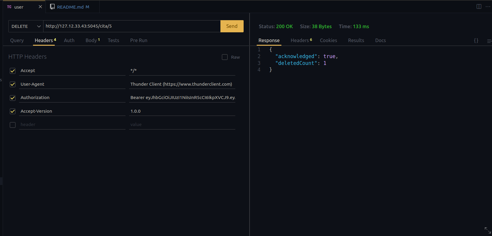<br><br>


# CONSULTAS ESPECIFICAS<br><br>

1. Obtener todas las citas numericamente

```js
  http://${config.hostname}:${config.port}/citaOrdenNumerico
```
<span style="color:blue;">Version:</span>
```js
  [1.0.0]
```
<br><br>

2. Obtener todos los pacientes alfabéticamente

```js
  http://${config.hostname}:${config.port}/patientOrderAlph
```
<span style="color:blue;">Version:</span>
```js
  [2.0.0]
```
<br><br>

3. Encontrar la próxima cita para un paciente específico (por ejemplo, el paciente con usu_id 1)

```js
  http://${config.hostname}:${config.port}/proxCitaUsuario/2
```
<span style="color:blue;">Version:</span>
```js
  [1.1.0]
```
En este caso el rango del paciente va del 1 al 5<br><br>

4. Encontrar todos los pacientes que tienen citas con un médico específico (por ejemplo, el médico con med_nroMatriculaProsional 1)

```js
  http://${config.hostname}:${config.port}/patientCitMedicoEspecifico/123456
```
<span style="color:blue;">Version:</span>
```js
  [2.1.0]
```
<span style="color:blue;">Matriculas Medicas Disponibles:</span>
```js
  '123456'
  '234567'
  '345678'
  '456789'
  '567890'
```
<br><br>

5. Obtener las consultorías para un paciente específico (por ejemplo, paciente con usu_id 1)

```js
  http://${config.hostname}:${config.port}/consultoriasPorCliente/1
```
<span style="color:blue;">Version:</span>
```js
  [2.2.0]
```
Pacientes Disponibles por id del 1 al 5<br><br>

6. Obtener todos los médicos de una especialidad específica (por ejemplo, 'Cardiología')

```js
  http://${config.hostname}:${config.port}/medicoPorEspecialidad/Cardiología
```
<span style="color:blue;">Version:</span>
```js
  [3.0.0]
```
<span style="color:blue;">Especialidades Disponibles:</span>
```js
  'Cardiología'
  'Dermatología'
  'Pediatría'
  'Oftalmología'
  'Gastroenterología'
```
<br><br>

7. Encontrar todas las citas para un día específico (por ejemplo, '2023-02-02')

```js
  http://${config.hostname}:${config.port}/citaDiaEspecifico/2
```
<span style="color:blue;">Version:</span>
```js
  [1.2.0]
```
<br><br>

8. Obtener los médicos y sus consultorios

```js
  http://${config.hostname}:${config.port}/consultoriaMedico/123456
```
<span style="color:blue;">Version:</span>
```js
  [3.1.0]
```
<br><br>


9. Contar el número de citas que un médico tiene en un día específico (por ejemplo, el médico con med_nroMatriculaProsional 123456 en '2023-07-12')

```js
  http://${config.hostname}:${config.port}/contarCitasMedicoDia/2023-07-12/123456
```
<span style="color:blue;">Version:</span>
```js
  [3.2.0]
```

10. Obtener los consultorio donde se aplicó las citas de un paciente

```js
  http://${config.hostname}:${config.port}/consultorioAplicadasCitasPacientes/2
```
<span style="color:blue;">Version:</span>
```js
  [1.3.0]
```

11. Obtener todas las citas realizadas por los pacientes de un genero si su estado de la cita fue atendidad

```js
  http://${config.hostname}:${config.port}/citasAtendidasXgenero/4
```
<span style="color:blue;">Version:</span>
```js
  [1.4.0]
```
<span style="color:blue;">Generos Disponibles:</span>
```js
  'Masculino':1,
  'Femenino':2,
  'Otro':3,
  'Bisexual':4,
  'Pansexual':5
```
Se introduce el el parametro el id del Genero requerido
<br><br>

12. Insertar un paciente a la tabla usuario pero si es menor de edad solicitar primero que ingrese el acudiente y validar si ya estaba registrado el acudiente.

Aca Debemos usar el metodo POST

```js
  http://${config.hostname}:${config.port}/insertaPacienteEdad
```
<span style="color:blue;">Version:</span>
```js
  [1.0.0]
```

# TECNOLOGIAS USADAS

<div>


</div>

# EXTENSIONES USADAS

MongoDB for VS Code

### Autor : Jose Alberto Cabrejo Villar